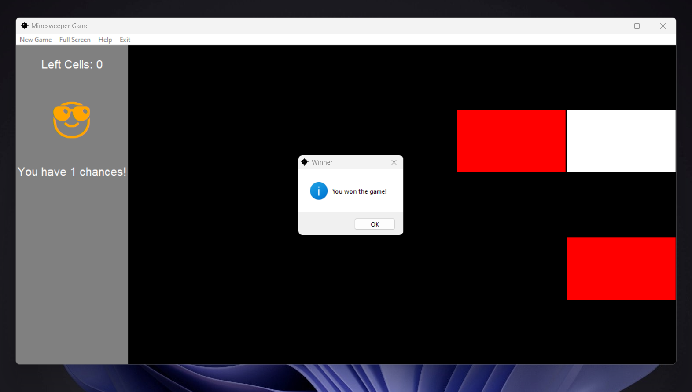

# Minesweeper Game

Minesweeper Game is a simple implementation of the classic Minesweeper game using the Tkinter library in Python. This game allows players to uncover cells on a grid, attempting to avoid hidden mines while revealing the number of adjacent mines in each cell.

## Features

- Classic Minesweeper gameplay with a 5x5 grid.
- Left-click to uncover cells and right-click to flag potential mines.
- Sidebar displays the number of remaining cells and chances.
- Full-screen toggle option available in the menu bar.
- New game option in the menu bar to reset the game.
- Help option in the menu bar to provide information about the game.
- Exit option in the menu bar to close the application.

## How to Play
- Left-click on a cell to uncover it.
- Right-click on a cell to flag a potential mine.
- Uncover all cells without hitting a mine to win.
- You have three chances. Losing all chances results in a game over.
- The sidebar displays the number of remaining cells and chances.
## Dependencies
- Python 3.x
- Tkinter library
## License
This project is licensed under the MIT License
## Author
Ahmed Hanye